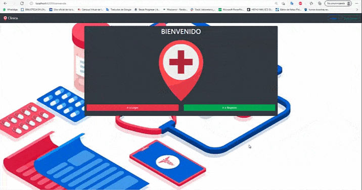
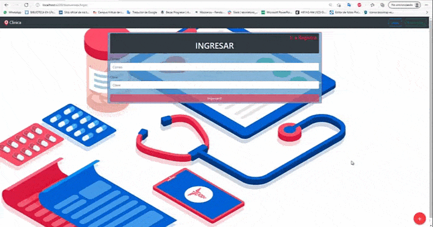
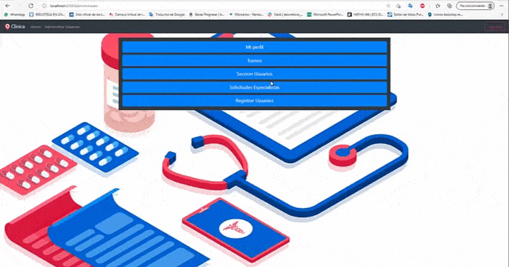

# Clinica Online

En este proyecto tendremos distintas funcionalidades para poder manejar una clinica como

<ul>
<li>Paciente</li>
<li>Especialista</li>
<li>Administrador</li>
</ul>

<h2>Pagina de Bienvenida y registro</h2>

Podremos registrarnos como pacientes o como especialistas.Se le enviara un mail al correo con el que se registro para poder acceder

<h2>Perfil Especialista</h2>

Desde aqui el especialista podra indicar que dias y en que horarios trabajara segun la especialidad

<h2>Como Administrador</h2>
<h3>Seccion Usuarios,Solicitudes de Especialistas y Registro de Administradores</h3>

<ul>
<li>En la seccion Usuarios tendremos un listado de los usuarios segun su tipo de perfil(Especialista,paciente o administrador)</li>
<li>En Solicitudes de Especialistas se ven las solicitudes de registro de nuevos especialistas a la clinica donde veremos sus especialidades y podremos aceptarlas o negarlas</li>
<li>En el registro de administradores podremos registrar nuevos administradores para que manejen la clinica</li>
</ul>

